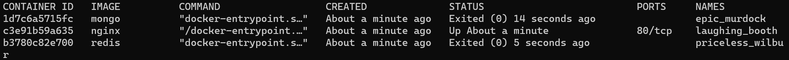
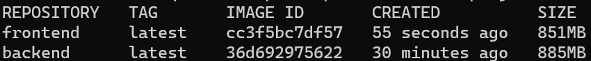
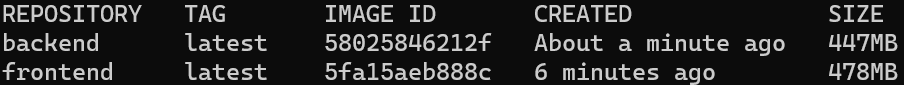
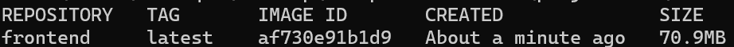
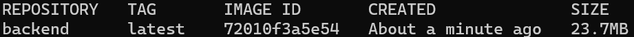

# DevOps With Docker (Problems)

## 1.1: Getting started

Since we already did “Hello, World!” in the material let’s do something else. Start 3 containers from image that does not automatically exit, such as nginx, detached. Stop 2 of the containers leaving 1 up.

Submit the output for docker ps -a which shows 2 stopped containers and one running.

&nbsp;

**Output**



&nbsp;

## 1.2: Cleanup

We’ve left containers and a image that won’t be used anymore and are taking space, as docker ps -as and docker images will reveal. Clean the docker daemon from all images and containers.

Submit the output for docker ps -a and docker images

&nbsp;

**Containers:**

    CONTAINER ID    IMAGE   COMMAND     CREATED     STATUS      PORTS       NAMES

**Images:**

    REPOSITORY      TAG     IMAGE ID    CREATED SIZE

&nbsp;

## 1.3: Secret message

Now that we’ve warmed up it’s time to get inside a container while it’s running!

Image devopsdockeruh/simple-web-service:ubuntu will start a container that outputs logs into a file. Go inside the container and use tail -f ./text.log to follow the logs. Every 10 seconds the clock will send you a “secret message”.

Submit the secret message and command(s) given as your answer.

&nbsp;

**Output**

    Secret message is: 'You can find the source code here: https://github.com/docker-hy'

&nbsp;

## 1.4: Missing dependencies

Start a ubuntu image with the process 
```sh
sh -c 'echo "Input website:"; read website; echo "Searching.."; sleep 1; curl http://$website;'
```

You will notice that a few things required for proper execution are missing. Be sure to remind yourself which flags to use so that the read actually waits for input.

Note also that curl is NOT installed in the container yet. You will have to install it from inside of the container.

Test inputting helsinki.fi into the application. It should respond with something like

```html
    <html>

        <head>
            <title>301 Moved Permanently</title>
        </head>

        <body>
            <h1>Moved Permanently</h1>
            <p>
                The document has moved 
                <a href="http://www.helsinki.fi/">here</a>.
            </p>
        </body>

    </html>
```

This time return the command you used to start process and the command(s) you used to fix the ensuing problems.

This exercise has multiple solutions, if the curl for helsinki.fi works then it’s done. Can you figure out other (smart) solutions?

&nbsp;

**Shell**

```sh
docker run -d -it --name missing-dependencies ubuntu sh -c "echo 'Input website:'; read website; echo 'Searching..'; sleep 1; curl http://$website;"

docker exec missing-dependencies sh -c "apt-get update && apt-get -y install curl"

docker attach missing-dependencies

helsinki.fi
```

&nbsp;

## 1.5: Sizes of images

In a previous exercise we used devopsdockeruh/simple-web-service:ubuntu.

Here is the same application but instead of ubuntu is using alpine: devopsdockeruh/simple-web-service:alpine.

Pull both images and compare the image sizes. Go inside the alpine container and make sure the secret message functionality is the same. Alpine version doesn’t have bash but it has sh.

&nbsp;

**Output**

    Secret message is: 'You can find the source code here: https://github.com/docker-hy'

&nbsp;

## 1.6: Hello Docker Hub

Run docker run -it devopsdockeruh/pull_exercise.

It will wait for your input. Navigate through docker hub to find the docs and Dockerfile that was used to create the image.

Read the Dockerfile and/or docs to learn what input will get the application to answer a “secret message”.

Submit the secret message and command(s) given to get it as your answer.

&nbsp;

**Shell**

```sh
docker run -it devopsdockeruh/pull_exercise
```

**Output**

    Give me the password: basics

    You found the correct password. Secret message is:
    "This is the secret message"

&nbsp;

## 1.7: Two line Dockerfile

By default our devopsdockeruh/simple-web-service:alpine doesn’t have a CMD. It instead uses ENTRYPOINT to declare which application is run.

We’ll talk more about ENTRYPOINT in the next section, but you already know that the last argument in docker run can be used to give command.

As you might’ve noticed it doesn’t start the web service even though the name is “simple-web-service”. A command is needed to start the server!

Try docker run devopsdockeruh/simple-web-service:alpine hello. The application reads the argument but will inform that hello isn’t accepted.

In this exercise create a Dockerfile and use FROM and CMD to create a brand new image that automatically runs the server. Tag the new image as “web-server”

Return the Dockerfile and the command you used to run the container.

Running the built “web-server” image should look like this:

    $ docker run web-server
    [GIN-debug] [WARNING] Creating an Engine instance with the Logger and Recovery middleware already attached.

    [GIN-debug] [WARNING] Running in "debug" mode. Switch to "release" mode in production.
    - using env:   export GIN_MODE=release
    - using code:  gin.SetMode(gin.ReleaseMode)

    [GIN-debug] GET    /*path                    --> server.Start.func1 (3 handlers)
    [GIN-debug] Listening and serving HTTP on :8080

We don’t have any method of accessing the web service yet. As such confirming that the console output is the same will suffice.

&nbsp;

**Dockerfile**

```Dockerfile
FROM devopsdockeruh/simple-web-service:alpine
CMD server
```

**Shell**

```sh
docker build . -t web-server
docker run web-server
```

&nbsp;

## 1.8: Image for script

Now that we know how to create and build Dockerfiles we can improve previous works.

Create a Dockerfile for a new image that starts from ubuntu:18.04.

Make a script file on you local machine with such content as echo "Input website:"; read website; echo "Searching.."; sleep 1; curl http://$website;. Transfer this file to an image and run it inside the container using CMD. Build the image with tag “curler”.

Run the new curler image with the correct flags and input helsinki.fi into it. Output should match the 1.4 one.

Return both Dockerfile and the command you used to run the container.

&nbsp;

**Dockerfile**

```Dockerfile
    FROM ubuntu:18.04

    RUN apt-get update; apt-get install -y curl;

    CMD echo "Input website:"; read website; echo "Searching.."; sleep 1; curl http://$website;
```

**Shell**
```sh
    docker build . -t curler

    docker run -it curler
```

&nbsp;

## 1.9: Volumes

In this exercise we won’t create a new Dockerfile.

Image devopsdockeruh/simple-web-service creates the a timestamp every two seconds to /usr/src/app/text.log when it’s not given a command. Start the container with bind mount so that the logs are created into your filesystem.

Submit the command you used to complete the exercise.

&nbsp;

**Shell**
    
```sh
touch /tmp/log.txt

docker run -v ${pwd}/tmp/log.txt:/usr/app/logs.txt devopsdockeruh/first_volume_exercise
```

**Output**

    Secret message is: **"Volume bind mount is easy"**

&nbsp;


## 1.10: Ports open

In this exercise we won’t create a new Dockerfile.

Image devopsdockeruh/simple-web-service will start a web service in port 8080 when given the command “server”. From 1.7 you should have an image ready for this. Use -p flag to access the contents with your browser. The output to your browser should be something like: { message: "You connected to the following path: ...

Submit your used commands for this exercise.

&nbsp;

**Shell**

```sh
docker run -d -it -p 8080:8080 --name port-mapping devopsdockeruh/simple-web-service sh -c 'server'
```

&nbsp;


## 1.11: Spring

Lets create a Dockerfile for a Java Spring project: github page (https://github.com/docker-hy/material-applications/tree/main/spring-example-project)

The setup should be straightforward with the README instructions. Tips to get you started:

Use openjdk image FROM openjdk:_tag_ to get java instead of installing it manually. Pick the tag by using the README and dockerhub page.

You’ve completed the exercise when you see a ‘Success’ message in your browser.

&nbsp;

**Dockerfile**

```Dockerfile
FROM openjdk:8

WORKDIR /usr/src

COPY . .

# The issue was that locally the mvnw script had Windows line endings (\r\n called CRLF).
RUN apt-get update && apt-get install -y dos2unix && find . -type f -print0 | xargs -0 dos2unix 

RUN ./mvnw package

CMD ["java", "-jar", "./target/docker-example-1.1.3.jar"]

EXPOSE 8080
```

&nbsp;

**Shell**

```sh
docker build . -t spring-project

docker run -p 8080:8080 spring-project
```

&nbsp;


## 1.12: Hello, frontend!

This exercise is mandatory

A good developer creates well written READMEs that can be used to create Dockerfiles with ease.

Clone, fork or download the project from https://github.com/docker-hy/material-applications/tree/main/example-frontend.

Create a Dockerfile for the project (example-frontend) and give a command so that the project runs in a docker container with port 5000 exposed and published so when you start the container and navigate to http://localhost:5000 you will see message if you’re successful.

Submit the Dockerfile.

As in other exercises, do not alter the code of the project

TIP: The project has install instructions in README.

TIP: Note that the app starts to accept connections when “Accepting connections at http://localhost:5000” has been printed to the screen, this takes a few seconds

TIP: You do not have to install anything new outside containers.

&nbsp;

**Dockerfile**

```Dockerfile
FROM ubuntu:latest

WORKDIR /usr/src

COPY . .

RUN apt-get update && apt-get install -y curl && curl https://deb.nodesource.com/setup_14.x | apt-get install -y nodejs

RUN apt-get install -y npm && npm install && npm run build && npm install -g serve

CMD ["npx", "serve", "-s", "-l", "5000", "build"]

EXPOSE 5000
```

**Shell**

```shell
    docker build . -t hello-frontend
    docker run -p 5000:5000 hello-frontend
```

&nbsp;


## 1.13: Hello, backend!

This exercise is mandatory

Clone, fork or download a project from https://github.com/docker-hy/material-applications/tree/main/example-backend.

Create a Dockerfile for the project (example-backend) and give a command so that the project runs in a docker container with port 8080 published.

When you start the container and navigate to http://localhost:8080/ping you should get a “pong” as response.

Submit the Dockerfile and the command used.

Do not alter the code of the project

&nbsp;

**Dockerfile**

```Dockerfile
FROM ubuntu:latest

COPY . .

RUN apt-get update && apt-get install -y wget gcc && rm -rf /usr/local/go && wget -c https://golang.org/dl/go1.16.3.linux-amd64.tar.gz && tar -C /usr/local -xzf go1.16.3.linux-amd64.tar.gz

ENV PATH /usr/local/go/bin:$PATH

RUN go build

RUN go test

CMD ./server

EXPOSE 8080
```

&nbsp;

## 1.14: Environment

This exercise is mandatory

Start both frontend-example and backend-example with correct ports exposed and add ENV to Dockerfile with necessary information from both READMEs (front,back).

Ignore the backend configurations until frontend sends requests to _backend_url_/ping when you press the button.

You know that the configuration is ready when the button for 1.14 of frontend-example responds and turns green.

Do not alter the code of either project

Submit the edited Dockerfiles and commands used to run.

The frontend will first talk to your browser. Then the code will be executed from your browser and that will send a message to backend.

TIP: When configuring web applications keep browser developer console ALWAYS open, F12 or cmd+shift+I when the browser window is open. Information about configuring cross origin requests is in README of the backend project.

TIP: Developer console has multiple views, most important ones are Console and Network. Exploring the Network tab can give you a lot of information on where messages are being sent and what is received as response!

&nbsp;


**Dockerfile (frontend)**

```Dockerfile
FROM ubuntu:latest

WORKDIR /usr/src

COPY . .

ENV REACT_APP_BACKEND_URL http://localhost:8080/

RUN apt-get update && apt-get install -y curl && curl https://deb.nodesource.com/setup_14.x | apt-get install -y nodejs

RUN apt-get install -y npm && npm install && npm run build && npm install -g serve

CMD ["npx", "serve", "-s", "-l", "5000", "build"]

EXPOSE 5000
```

**Dockerfile (backend)**

```Dockerfile
FROM ubuntu:latest

COPY . .

RUN apt-get update && apt-get install -y wget gcc && rm -rf /usr/local/go && wget -c https://golang.org/dl/go1.16.3.linux-amd64.tar.gz && tar -C /usr/local -xzf go1.16.3.linux-amd64.tar.gz

ENV PATH /usr/local/go/bin:$PATH

ENV REQUEST_ORIGIN http://localhost:5000

RUN go build

RUN go test

CMD ./server

EXPOSE 8080
```

**Shell**

```sh
docker build . -t hello-backend
docker run -d -p 8080:8080 hello-backend

docker build . -t hello-frontend
docker run -d -p 5000:5000 hello-frontend
```

&nbsp;


## 2.1

Exercises in part 2 should be done using docker-compose

Without a command devopsdockeruh/simple-web-service will create logs into its /usr/src/app/text.log.

Create a docker-compose.yml file that starts devopsdockeruh/simple-web-service and saves the logs into your filesystem.

Submit the docker-compose.yml, make sure that it works simply by running docker-compose up if the log file exists.

&nbsp;

**docker-compose.yml**

```yml
version: "3.9"

services:
    logger:
        image: devopsdockeruh/simple-web-service
        build: .
        volumes: 
            - ./log:/usr/src/app/text.log
        container_name: logger
```

&nbsp;


## 2.2

Read about how to add command to docker-compose.yml from the documentation.

The familiar image devopsdockeruh/simple-web-service can be used to start a web service.

Create a docker-compose.yml and use it to start the service so that you can use it with your browser.

Submit the docker-compose.yml, make sure that it works simply by running docker-compose up

&nbsp;

**docker-compose.yml**

```yml
version: "3.9"

services:
    web:
        image: devopsdockeruh/simple-web-service
        build: .
        ports: 
            - 8080:8080 
        command: server
        container_name: web
```

&nbsp;


## 2.3

This exercise is mandatory

As we saw previously, starting an application with two programs was not trivial and the commands got a bit long.

In the previous part we created Dockerfiles for both frontend and backend. Next, simplify the usage into one docker-compose.yml.

Configure the backend and frontend from part 1 to work in docker-compose.

Submit the docker-compose.yml

&nbsp;

**Dockerfile (frontend)**

```Dockerfile
FROM node

WORKDIR /app

COPY . .

ENV REACT_APP_BACKEND_URL http://localhost:8080/

RUN npm install && npm run build && npm install -g serve

CMD ["npx", "serve", "-s", "-l", "5000", "build"]
```

**Dockerfile (backend)**

```Dockerfile
FROM golang

WORKDIR /app

COPY . .

ENV REQUEST_ORIGIN http://localhost:5000

RUN go build

CMD ./server
```

**docker-compose.yml**

```yml
version: "3.9"

services:
    backend: 
        container_name: backend
        build: ./backend
        ports: 
            - 8080:8080
    frontend:
        container_name: frontend
        build: ./frontend
        ports:
            - 5000:5000
```

&nbsp;


## 2.4

Add redis to example backend.

Redis is used to speed up some operations. Backend uses a slow api to get information. You can test the slow api by requesting /ping?redis=true with curl. The frontend program has a button to test this.

Configure a redis container to cache information for the backend. Use the documentation if needed when configuring: https://hub.docker.com/_/redis/

The backend README should have all the information needed to connect.

When you’ve correctly configured the button will turn green.

Submit the docker-compose.yml

restart: unless-stopped can help if the redis takes a while to get ready

TIP: If you’re stuck check out tips and tricks

&nbsp;

**docker-compose.yml**

```yml
version: "3.9"

services:
    backend: 
        container_name: backend
        build: ./backend
        environment:
            REDIS_HOST: redis
        depends_on:
            - redis
        ports: 
            - 8080:8080
    frontend:
        container_name: frontend
        build: ./frontend
        depends_on:
            - backend
        ports:
            - 5000:5000
    redis:
        container_name: redis-cache
        image: redis
        restart: unless-stopped
```

&nbsp;

## 2.5

A project over at https://github.com/docker-hy/material-applications/tree/main/scaling-exercise has a hardly working application. Go ahead and clone it for yourself. The project already includes docker-compose.yml so you can start it by running docker-compose up.

Application should be accessible through http://localhost:3000. However it doesn’t work well enough and I’ve added a load balancer for scaling. Your task is to scale the compute containers so that the button in the application turns green.

This exercise was created with Sasu Mäkinen

Please return the used commands for this exercise.

&nbsp;

**Shell**

```sh
docker up --scale compute=2
```

&nbsp;

## 2.6

Add database to example backend.

Lets use a postgres database to save messages. We won’t need to configure a volume since the official postgres image sets a default volume for us. Lets use the postgres image documentation to our advantage when configuring: https://hub.docker.com/_/postgres/. Especially part Environment Variables is of interest.

The backend README should have all the information needed to connect.

The button won’t turn green but you can send messages to yourself.

Submit the docker-compose.yml

TIP: When configuring the database, you might need to destroy the automatically created volumes. Use command docker volume prune, docker volume ls and docker volume rm to remove unused volumes when testing. Make sure to remove containers that depend on them beforehand.

restart: unless-stopped can help if the postgres takes a while to get ready

&nbsp;

**docker-compose.yml**

```yml
version: "3.9"

services:
    backend: 
        container_name: backend
        build: ./backend
        environment:
            REDIS_HOST: redis
            POSTGRES_HOST: postgres
            POSTGRES_USER: postgres
            POSTGRES_PASSWORD: postgres
            POSTGRES_DATABASE: postgres
        depends_on:
            - redis
            - postgres
        ports: 
            - 8080:8080
    frontend:
        container_name: frontend
        build: ./frontend
        depends_on:
            - backend
        ports:
            - 5000:5000
    redis:
        container_name: redis
        image: redis
        restart: unless-stopped
    postgres:
        container_name: postgres
        image: postgres
        environment:
            # POSTGRES_PASSWORD is the only one required for database initialisation
            POSTGRES_HOST: postgres
            POSTGRES_USER: postgres
            POSTGRES_PASSWORD: postgres
            POSTGRES_DATABASE: postgres
```

&nbsp;

## 2.7

Configure a machine learning project.

Look into machine learning project created with Python and React and split into three parts: frontend, backend and training

Note that the training requires 2 volumes and backend should share volume /src/model with training.

The frontend will display on http://localhost:3000 and the application will tell if the subject of an image looks more like a cucumber or a moped.

Submit the docker-compose.yml

This exercise is known to have broken for some attendees based on CPU. The error looks something like “Illegal instruction (core dumped)”. Try downgrading / upgrading the tensorflow found in requirements.txt or join the telegram channel and message with @jakousa.

Note that the generated model is a toy and will not produce good results.

It will take SEVERAL minutes to build the docker images, download training pictures and train the classifying model.

This exercise was created by Sasu Mäkinen

&nbsp;

**docker-compose.yml**

```yml
version: "3.9"

services:
    ml-backend:
        container_name: ml-backend
        build: ./backend
        ports:
            - 5000:5000
        volumes:
            - model:/src/model
        depends_on:
            - ml-training
    ml-frontend:
        container_name: ml-frontend
        build: ./frontend
        ports:
            - 3000:3000
    ml-training:
        container_name: ml-training
        build: ./training
        volumes:
            - model:/src/model
            - images:/src/imgs
            - data:/src/data
volumes:
    model:
    images:
    data:
```

&nbsp;


## 2.8

Add nginx to example frontend + backend.

Accessing your service from arbitrary port is counter intuitive since browsers use 80 (http) and 443 (https) by default. And having the service refer to two origins in a case where there’s only one backend isn’t desirable either. We will skip the SSL setup for https/443.

Nginx will function as a reverse proxy for us (see the image above). The requests arriving at anything other than /api will be redirected to frontend container and /api will get redirected to backend container.

At the end you should see that the frontend is accessible simply by going to http://localhost and the button works. Other buttons may have stopped working, do not worry about them.

As we will not start configuring reverse proxies on this course you can have a simple config file:

The following file should be set to /etc/nginx/nginx.conf inside the nginx container. You can use a file volume where the contents of the file are the following:

```nginx
events { worker_connections 1024; }

http {
    server {
    listen 80;

    location / {
        proxy_pass _frontend-connection-url_;
    }

    location /api/ {
        proxy_set_header Host $host;
        proxy_pass _backend-connection-url_;
    }
    }
}
```

Nginx, backend and frontend should be connected in the same network. See the image above for how the services are connected.

Submit the docker-compose.yml

Tips for making sure the backend connection works:

Try using your browser to access http://localhost/api/ping and see if it answers pong

It might be nginx configuration problem: Add trailing / to the backend url in the nginx.conf.

&nbsp;

**docker-compose.yml**

```yml
version: "3.9"

services:
    backend: 
        container_name: backend
        build: ./backend
        environment:
            REDIS_HOST: redis
            POSTGRES_HOST: postgres
            POSTGRES_USER: postgres
            POSTGRES_PASSWORD: postgres
            POSTGRES_DATABASE: postgres
            REQUEST_ORIGIN: http://localhost:80
        depends_on:
            - redis
            - postgres
    frontend:
        container_name: frontend
        build: ./frontend
        environment:
            REACT_APP_BACKEND_URL: http://localhost:80
    redis:
        container_name: redis
        image: redis
        restart: unless-stopped
    postgres:
        container_name: postgres
        image: postgres
        environment:
            # POSTGRES_PASSWORD is the only one required for database initialisation
            POSTGRES_HOST: postgres
            POSTGRES_USER: postgres
            POSTGRES_PASSWORD: postgres
            POSTGRES_DATABASE: postgres
    nginx:
        container_name: nginx
        image: nginx
        ports:
            - 80:80
        volumes:
            - ./nginx.config:/etc/nginx/nginx.conf
```

`nginx.conf`

```nginx

events { worker_connections 1024; }

http {
    server {
        listen 80;

        location /api/ {
            proxy_pass http://backend:8080/;
        }

        location / {
            proxy_pass http://frontend:5000/;
        }
    }
}
```

&nbsp;

## 2.9

Postgres image uses a volume by default. Manually define volumes for the database in convenient location such as in ./database . Use the image documentations (postgres) to help you with the task. You may do the same for redis as well.

After you have configured the volume:

Save a few messages through the frontend
Run docker-compose down
Run docker-compose up and see that the messages are available after refreshing browser
Run docker-compose down and delete the volume folder manually
Run docker-compose up and the data should be gone

Maybe it would be simpler to back them up now that you know where they are.

TIP: To save you the trouble of testing all of those steps, just look into the folder before trying the steps. If it’s empty after docker-compose up then something is wrong.

TIP: Since you may have broken the buttons in nginx exercise you should test with docker-compose.yml from before it

Submit the docker-compose.yml

&nbsp;

**docker-compose.yml**

``` yml
version: "3.9"

services:
    backend: 
        container_name: backend
        build: ./backend
        environment:
            REDIS_HOST: redis
            POSTGRES_HOST: postgres
            POSTGRES_USER: postgres
            POSTGRES_PASSWORD: postgres
            POSTGRES_DATABASE: postgres
            REQUEST_ORIGIN: http://localhost:80
        depends_on:
            - redis
            - postgres
    frontend:
        container_name: frontend
        build: ./frontend
        environment:
            REACT_APP_BACKEND_URL: http://localhost:80
    redis:
        container_name: redis
        image: redis
        restart: unless-stopped
        volumes:
            - ./redis:/data
    postgres:
        container_name: postgres
        image: postgres
        environment:
            # POSTGRES_PASSWORD is the only one required for database initialisation
            POSTGRES_HOST: postgres
            POSTGRES_USER: postgres
            POSTGRES_PASSWORD: postgres
            POSTGRES_DATABASE: postgres
        volumes:
            - ./database:/var/lib/postgresql/data
    nginx:
        container_name: nginx
        image: nginx
        ports:
            - 80:80
        volumes:
            - ./nginx.config:/etc/nginx/nginx.conf
```

&nbsp;

## 2.10

Some buttons may have stopped working in the frontend + backend project. Make sure that every button for exercises works.

This may need a peek into the browsers developer consoles again like back part 1. The buttons of nginx exercise and the first button behave differently but you want them to match.

If you had to do any changes explain what you had to change.

Submit the docker-compose yml and both dockerfiles.

&nbsp;

`nginx.conf`

```nginx
events { worker_connections 1024; }

http {
    server {
        listen 80;

        location /api/ {
            proxy_pass http://backend:8080/;
        }

        location /messages {
            proxy_pass http://backend:8080/messages;
        }

        location /ping {
            proxy_pass http://backend:8080/ping;
        }

        location /slow {
            proxy_pass http://backend:8080/slow;
        }

        location / {
            proxy_pass http://frontend:5000/;
        }
    }
}
```

&nbsp;

## 3.3

This exercise is mandatory

In the previous parts we created Dockerfiles for both example frontend and backend.

Security issues with the user being a root are serious for the example frontend and backend as the containers for web services are supposed to be accessible through the internet.

Make sure the containers start their processes as a non-root user.

TIP man chown may help you if you have access errors

&nbsp;

**Dockerfile (backend)**

```Dockerfile
FROM ubuntu:latest

COPY . .

RUN apt-get update && apt-get install -y wget gcc && rm -rf /usr/local/go && wget -c https://golang.org/dl/go1.16.3.linux-amd64.tar.gz && tar -C /usr/local -xzf go1.16.3.linux-amd64.tar.gz && useradd -m appuser

ENV PATH /usr/local/go/bin:$PATH

ENV REQUEST_ORIGIN http://localhost:5000

RUN go build

RUN go test

USER appuser

CMD ./server

EXPOSE 8080 
```

&nbsp;

**Dockerfile (frontend)**

```Dockerfile
FROM ubuntu:latest

WORKDIR /usr/src

COPY . .

ENV REACT_APP_BACKEND_URL http://localhost:8080/

RUN apt-get update && apt-get install -y curl && curl https://deb.nodesource.com/setup_14.x | apt-get install -y nodejs && useradd -m appuser

RUN apt-get install -y npm && npm install && npm run build && npm install -g serve

USER appuser

CMD ["npx", "serve", "-s", "-l", "5000", "build"]

EXPOSE 5000
```
    

&nbsp;


## 3.4

Return back to our frontend & backend Dockerfiles and you should see the some mistakes we now know to fix.

Document both image sizes at this point, as was done in the material. Optimize the Dockerfiles of both programs, frontend and backend, by joining the RUN commands and removing useless parts.

After your improvements document the image sizes again. The size difference may not be very much yet. The frontend should be around 432MB when using FROM ubuntu:18.04. The backend should be around 351MB. The sizes may vary.

&nbsp;

**Dockerfile (frontend)**

```Dockerfile
FROM ubuntu:latest

WORKDIR /usr/src

COPY . .

ENV REACT_APP_BACKEND_URL http://localhost:8080/

RUN apt-get update && apt-get install -y curl && curl https://deb.nodesource.com/setup_14.x | apt-get install -y nodejs && apt-get install -y npm && npm install && npm run build && npm install -g serve && useradd -m appuser

USER appuser

CMD ["npx", "serve", "-s", "-l", "5000", "build"]

EXPOSE 5000
```

&nbsp;

**Dockerfile (backend)**

```Dockerfile

FROM ubuntu:latest

COPY . .

ENV PATH /usr/local/go/bin:$PATH
ENV REQUEST_ORIGIN http://localhost:5000

RUN apt-get update && apt-get install -y wget gcc && rm -rf /usr/local/go && wget -c https://golang.org/dl/go1.16.3.linux-amd64.tar.gz && tar -C /usr/local -xzf go1.16.3.linux-amd64.tar.gz && go build && go test && useradd -m appuser

USER appuser

CMD ./server

EXPOSE 8080
```


&nbsp;

## 3.5

Document the image size before the changes.

Let’s test what the image sizes are when using FROM golang and FROM node in the backend and frontend projects respectively.

Return back to our frontend & backend Dockerfiles and change the FROM to something more suitable. Both should have at least alpine variants ready in DockerHub. Make sure the application still works after the changes.

Document the size after your changes.

&nbsp;

**Image size - before:**



**Image size - after:**



&nbsp;

## 3.6: Multi-stage frontend

Multi-stage builds. Lets do a multi-stage build for the frontend project since we’ve come so far with the application.

Even though multi-stage builds are designed mostly for binaries in mind, we can leverage the benefits with our frontend project as having original source code with the final assets makes little sense. Build it with the instructions in README and the built assets should be in build folder.

You can still use the serve to serve the static files or try out something else.

&nbsp;

**Image size:**



&nbsp;

**Dockerfile**

```Dockerfile
FROM node:stretch-slim as react-build

WORKDIR /app

COPY . .

RUN npm install && npm run build

FROM alpine:latest

WORKDIR /root/

RUN apk add --update nodejs npm && npm install -g serve

COPY --from=react-build ./app/build ./build

CMD ["npx", "serve", "-s", "-l", "5000", "build"] 

EXPOSE 5000
```

&nbsp;

## 3.6: Multi-stage backend

Lets do a multi-stage build for the backend project since we’ve come so far with the application.

The project is in golang and building a binary that runs in a container, while straightforward, isn’t exactly trivial. Use resources that you have available (Google, example projects) to build the binary and run it inside a container that uses FROM scratch.

To pass the exercise the image must be smaller than 25MB.

&nbsp;

**Image size:**



&nbsp;

**Dockerfile**


```Dockerfile
FROM golang:alpine3.13 AS golang-build

WORKDIR /app

COPY . .

RUN go build

FROM alpine:latest  

WORKDIR /root/

COPY --from=golang-build ./app/server ./server

CMD ["./server"]  

EXPOSE 8080
```

&nbsp;